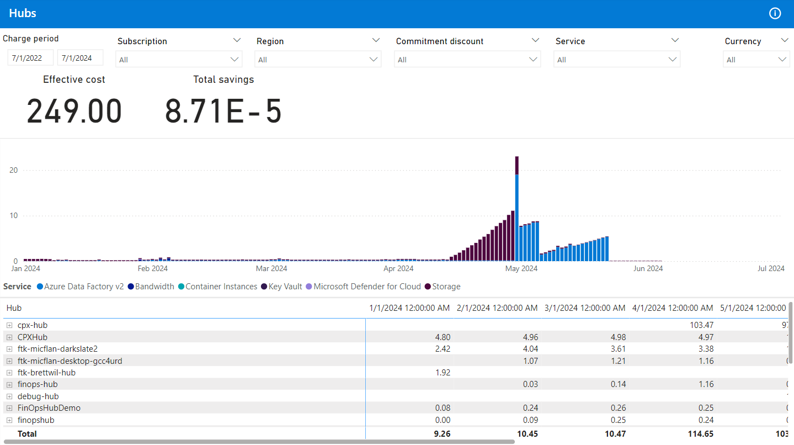
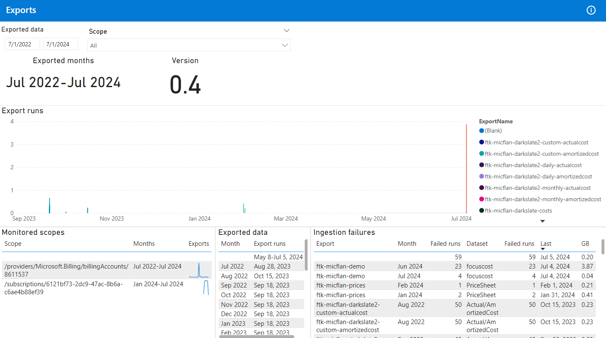
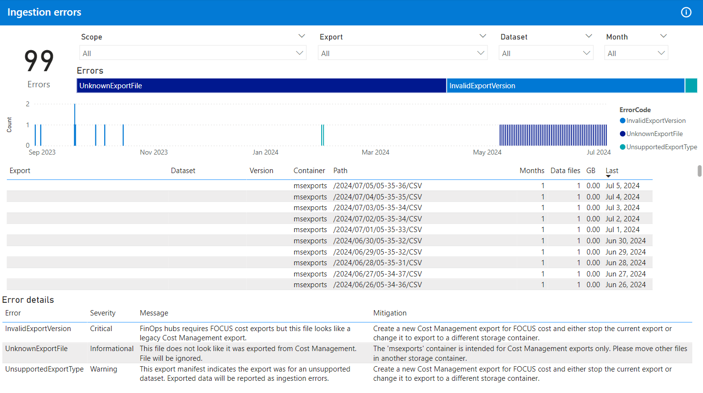

<!-- markdownlint-disable-next-line MD025 -->
# Data ingestion report

The **Data ingestion report** provides details about the data you've ingested into your FinOps hub storage account.

You can download the Data ingestion report from the [latest release](https://github.com/microsoft/finops-toolkit/releases/latest).

 

## Get started

The **Get started** page includes a basic introduction to the report with additional links to learn more.

 

## Hubs

The **Hubs** page shows the cost of any FinOps hubs instances. Expand each instance to see the cost broken down by service (e.g., Storage or Key Vault). Most organizations will only have one hub instance. This page can be helpful in confirming how much your hub instance is costing you and if there are additional hub instances deployed within the organization, which could possibly be centralized.

This page includes the same KPIs as most pages within the [Cost summary report](./cost-summary.md):

- **Effective cost** shows the effective cost for the period with reservation purchases amortized across the commitment term.
- **Total savings** shows how much you're saving compared to list prices.

 

## Exports

The **Exports** page shows which months have been exported for which scopes, when the exports were run, and if any of the ingestion flows failed. Failures can be identified by CSV files in the `msexports` container since that means they were not fully ingested. To investigate why ingestion failed, you will need to review the logs in Azure Data Factory. In general, as long as another ingestion was completed for that month, you are covered. Mid-month ingestion failures will not result in missing data since Cost Management re-exports the previous days' data in each export run. Exports are typically run up to the 5th of the following month. If you see a date after the 5th, then that usually means someone ran a one-time export for the month.

<blockquote class="tip" markdown="1">
  _If you only see one export run per month, you may have configured file overwriting. While this seting is important when using Power BI against raw data exports, it is not recommended for FinOps hubs because it removes the ability to monitor export runs over time (since files are deleted)._
</blockquote>

 

## Ingestion

The **Ingestion** page shows which months have been ingested and are available for querying in Power BI and other client apps. Note that the FinOps hubs ingestion process does not create new files every day, so you may only see 1-2 files. The number of files is determined by Cost Management when generating the initial partitioned CSV files.

Similar to exports that are run until the 5th of the following month, you will typically see ingested months being updated until the 5th of the following month. If you see a date later than the 5th, this is usually due to a one-time export run.

If you notice exports from before ingested months, this typically means older data was removed from the `ingestion` container but the export metadata was not removed from `msexports`. Files in `msexports` can be safely be removed at any time. They are only useful for monitoring export runs.

 

## Ingestion errors

The **Ingestion errors** page summarizes potential issues that have been identified after reviewing data in hub storage. For troubleshooting details about each error, refer to [Troubleshooting](../../_resources/troubleshooting.md).

 

## Related content

Related FinOps capabilities:

- [Data ingestion](../../framework/understand/ingestion.md)

Related products:

- [Cost Management](/azure/cost-management-billing/costs/)

Related solutions:

- [FinOps hubs](../hubs/finops-hubs-overview.md)

 

## Looking for more?

We'd love to hear about any reports, charts, or general reporting questions you're looking to answer. Create a new issue with the details that you'd like to see either included in existing or new reports.

[Share feedback](https://aka.ms/ftk/idea)

 
