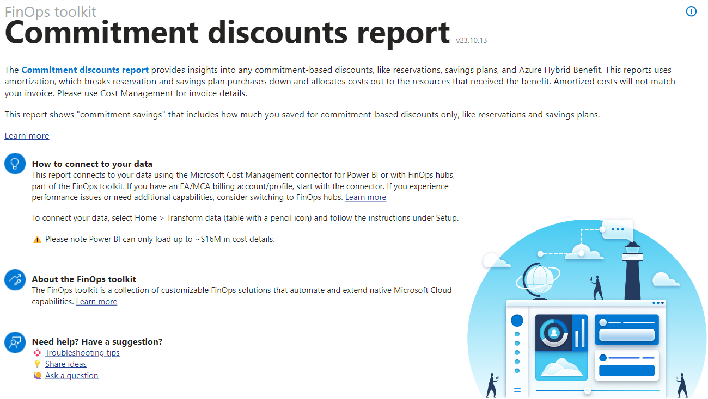
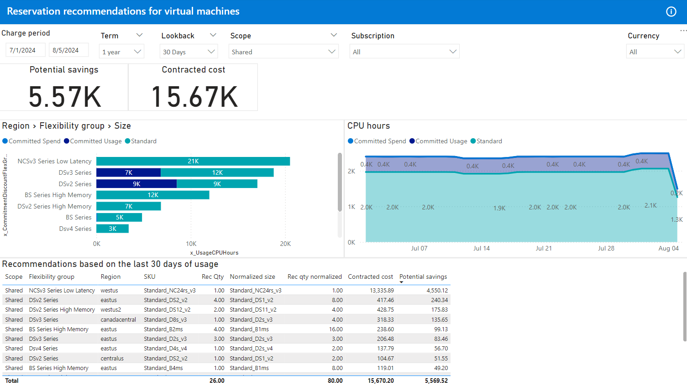
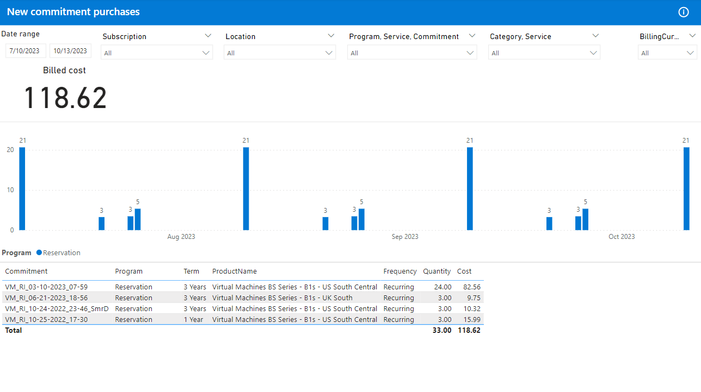
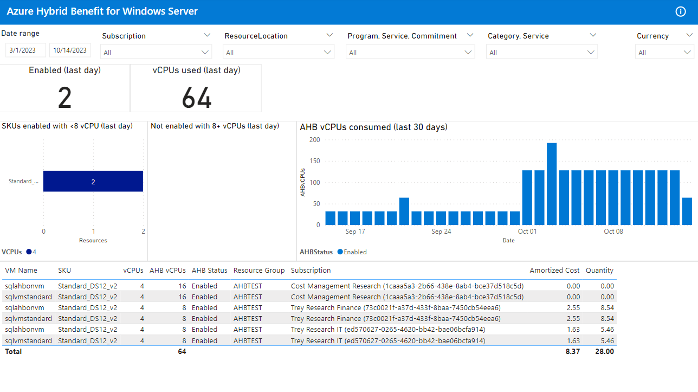
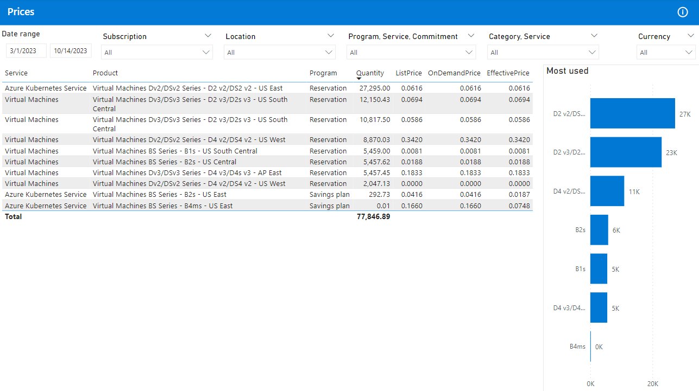
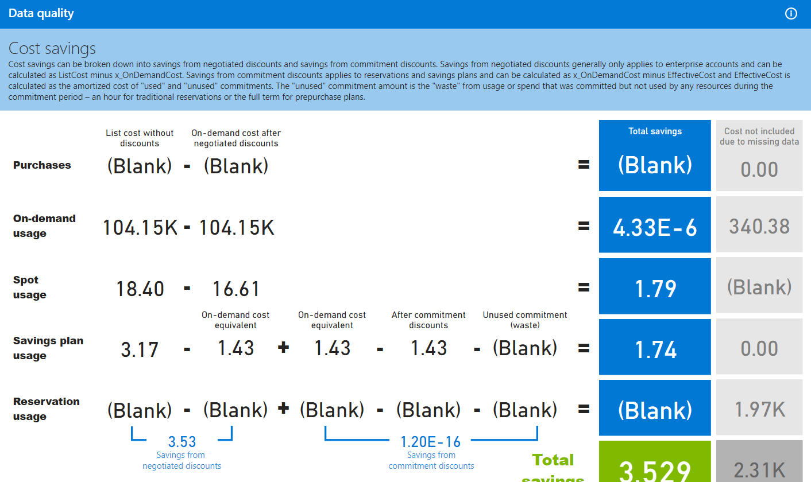

<!-- markdownlint-disable-next-line MD025 -->
# Rate optimization report

The **Rate optimization report** summarizes existing and potential savings from commitment discounts, like reservations and savings plans. This report enables you to:

- Review Azure Hybrid Benefit usage.
- Identify and resolve any under-utilized commitments (aka utilization).
- Identify opportunity to save with more commitment discounts (aka coverage).
- Determine which resources used commitment discounts (aka chargeback).
- Summarize cost savings from commitment discounts.

You can download the Rate optimization report from the [latest release](https://github.com/microsoft/finops-toolkit/releases).

> [!NOTE]
> The "Commitment discounts" report was renamed to "Rate optimization" in FinOps toolkit 0.4. The purpose and intent of the report remains the same.

 

## Working with this report

This report includes the following filters on each page:

- Charge period (date range)
- Subscription and resource group
- Region
- Commitment (e.g., reservation, savings plan)
- Service (e.g., Virtual machines, SQL database)
- Currency

A few common KPIs you fill find in this report are:

- **Effective cost** shows the effective cost for the period with reservation purchases amortized across the commitment term.
- **Utilization** shows the percentage of your current commitments were used during the period.
- **Commitment savings** shows how much you're saving with commitment discounts.
  > [!IMPORTANT]
  > Microsoft Cost Management does not include the unit price for amortized charges with Microsoft Customer Agreement accounts, so commitment savings cannot be calculated. Please file a support request and speak to your field rep to escalate this.

 

## Get started

The **Get started** page includes a basic introduction to the report with additional links to learn more.

 

## Commitments

The **Commitments** page provides a list of your commitment discounts and offers a summary of the quantity used, utilization, savings, and effective cost for the period.

The chart breaks down the cost of used (utilized) vs. unused charges. Unused charges are split out by commitment type (e.g., reservation, savings plan).

 

## Savings

The **Savings** page summarizes cost savings obtained from commitment discounts. Commitments are grouped by program and service.

The chart shows total cost savings for the period split out by commitment type (e.g., reservation, savings plan).

> [!WARNING]
> Microsoft Cost Management does not include the unit price for amortized charges with Microsoft Customer Agreement accounts, so commitment savings cannot be calculated. Please file a support request and speak to your field rep to escalate this.

 

## Chargeback

<!-- NOTE: This page is duplicated in the cost-summary.md file as "Commitments". Please keep both updated at the same time. -->

The **Chargeback** page helps facilitate chargeback at a subscription, resource group, or resource level. Use the table for chargeback.

The chart shows the amortized cost for each subscription that used a commitment. If you see **Unassigned**, that is the unused cost that is not associated with a subscription.

> [!NOTE]
> This page is also available in the Cost summary report as "Commitments" to show how commitments impact resource costs.

### Chargeback customization tips

- Consider changing the columns in the table based on your chargeback needs.
- If you use tags for cost allocation, create custom columns in the CostDetails table that extract their values, then add those as columns into the visual for reporting.
- Consider bringing in external data for additional allocation options.

 

## Reservation recommendations

The **Reservation recommendations** page helps you identify any places where you could potentially save even more based on your historical usage patterns with virtual machine reservations within a single subscription or shared across all subscriptions.

These pages use the following filters for reservation recommendations:

- **Term** – Length of time for a reservation.
- **Lookback** – Period of historical time to use when recommending future reservations (e.g., 7-day, 30-day). Options are based on data you export.
- **Scope** – Indicates whether to view shared or single scope recommendations. Options are based on data you export.
- **Subscription** – Indicates which subscription you want to see recommendations for. All are shown by default.

The KPIs on this page cover:

- **Potential savings** shows what you could save if you purchase the recommended VM reservations.
- **Contracted cost** shows the cost that would be covered by the recommended reservations.

There are 2 charts on the page that offer a breakdown of location, instance size flexibility group, and size; and, CPU hours over time. Your goal is to increase the committed usage in green and spend in blue in order to decrease the contracted cost in red, which costs you more.

The table below the charts shows the recommended reservations based on the specified lookback period.

> [!IMPORTANT]
> The reservation recommendations page utilizes Cost Management exports either directly in storage (via the **Export Storage URL** parameter) or as part of FinOps hubs. If you do not see recommendations, confirm that you have configured exports and the filters at the top of the page align to the recommendations you exported (e.g., term, lookback, scope).

 

> [!IMPORTANT]
> Potential savings and contracted cost estimations are only available for VM reservation recommendations. This page has not been tested for non-VM recommendations. You can view savings plan and reservation recommendations for other services in the Azure portal.

 

## Purchases

<!-- NOTE: There is a similar page in the cost-summary.md file. They are not identical. Please keep both updated at the same time. -->

The **Purchases** page shows any new commitment discount purchases (either monthly or upfront payments) within the specified period.

There is one, **Billed cost** KPI which shows the total cost of the purchases as it is shown on your invoice. Note this is different than the cost on other pages, which show amortized cost.

The chart shows the purchases over time and the table shows a list of the commitments that were purchased, including the term, product, and payment frequency (**OneTime** is for upfront payments and **Recurring** is for monthly).

 

## Hybrid Benefit

<!-- NOTE: This page is duplicated in the cost-summary.md file. Please keep both updated at the same time. -->

The **Hybrid Benefit** page shows Azure Hybrid Benefit (AHB) usage for Windows Server virtual machines (VMs).

KPIs show how many VMs are using Azure Hybrid Benefit and how many vCPUs are used.

There are 3 charts on the page:

1. SKU names and number of VMs currently using less than 8 vCPUs. These are under-utilizing AHB.
2. SKU names and number of VMs with 8+ vCPUs that are not currently using AHB.
3. Daily breakdown of AHB and non-AHB usage (excluding those where AHB is not supported).

The table shows a list of VMs that are currently using or could be using AHB with their vCPU count, AHB vCPU count, resource group, subscription, cost and quantity.

 

## Prices

<!-- NOTE: There is a similar page in the cost-summary.md file. They are not identical. Please keep both updated at the same time. -->

The **Prices** page shows the prices for all products that were used with commitment discounts during the period.

The chart shows a summary of the meters that were used the most.

 

## DQ

The **Data quality** page shows some of the data used to calculate savings at a cost and unit price level. This can be helpful in understanding the data but also in identifying issues in Cost Management data that result in an incomplete picture of cost savings (e.g., missing price and cost values). If you are missing any data, please contact support to help raise the priority of these bugs in Cost Management.

 

## Related content

Related resources:

- [What is FOCUS?](../../focus/what-is-focus.md)

<!-- TODO: Bring in after these resources are moved
- [Common terms](../../_resources/terms.md)
- [Data dictionary](../../_resources/data-dictionary.md)
-->

Related FinOps capabilities:

- [Rate optimization](../../framework/optimize/rates.md)

Related products:

- [Cost Management](/azure/cost-management-billing/costs/)

Related solutions:

- [FinOps hubs](../hubs/finops-hubs-overview.md)
- [FinOps workbooks](https://aka.ms/finops/workbooks)
- [FinOps toolkit open data](../open-data.md)

 

## Looking for more?

We'd love to hear about any reports, charts, or general reporting questions you're looking to answer. Create a new issue with the details that you'd like to see either included in existing or new reports.

[Share feedback](https://aka.ms/ftk/idea)

 
